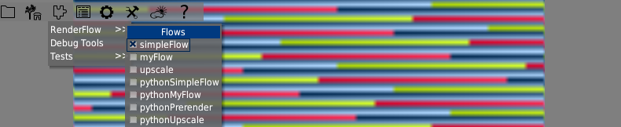
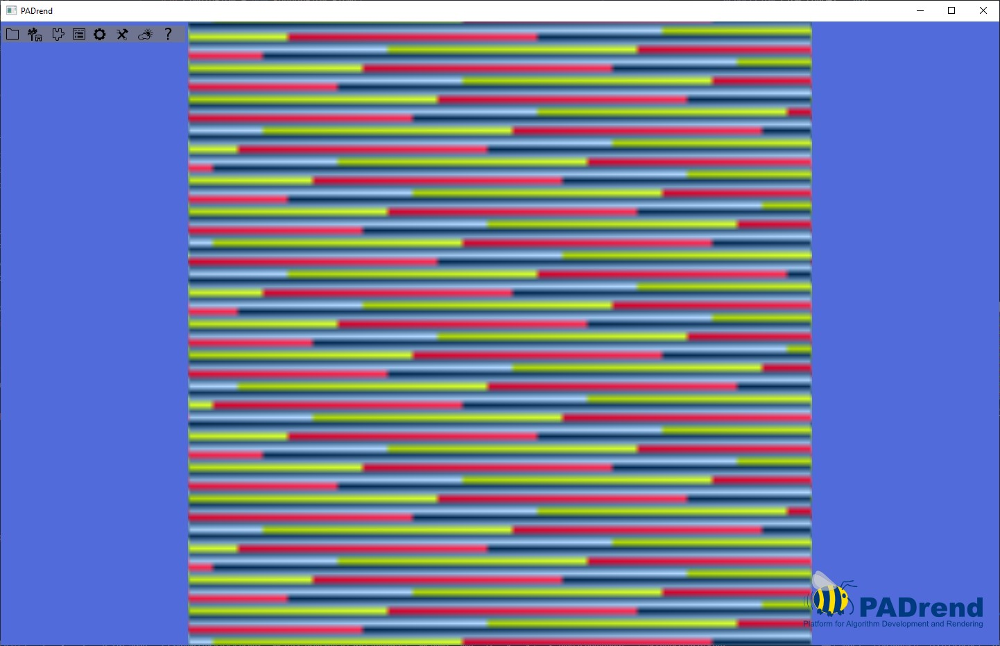
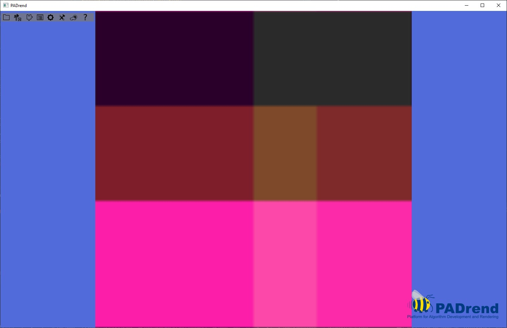
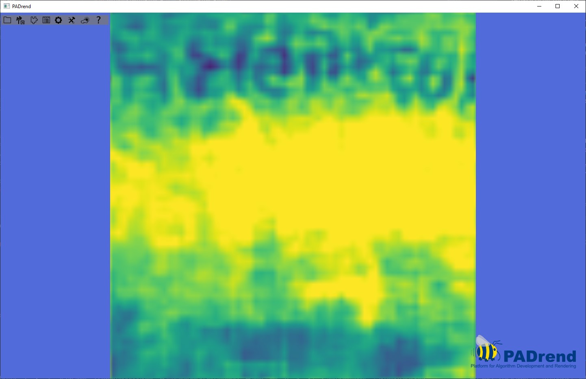
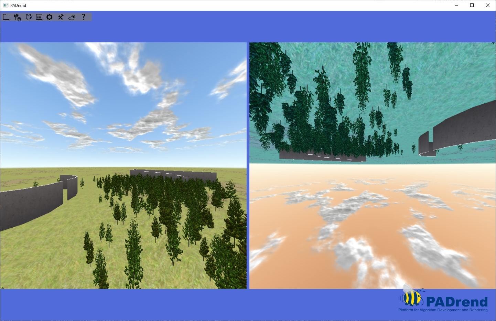
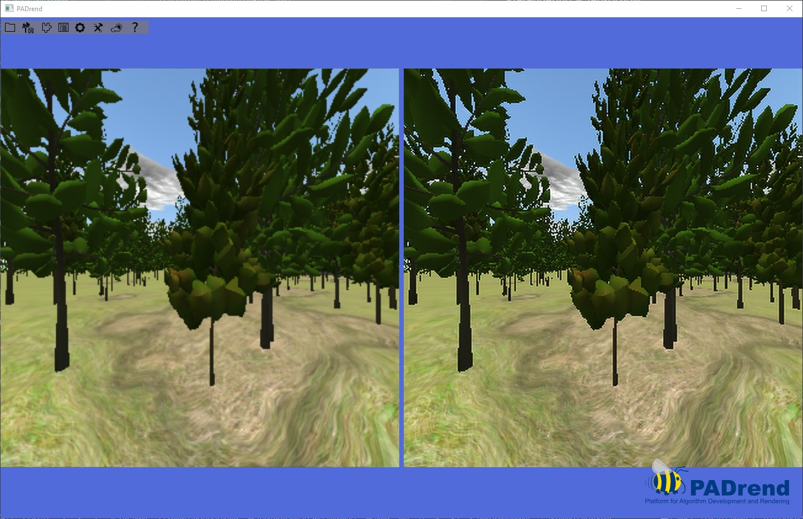
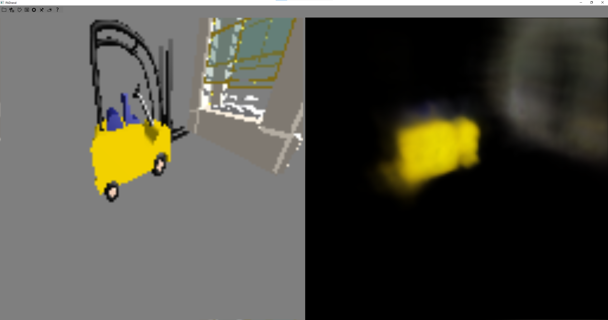
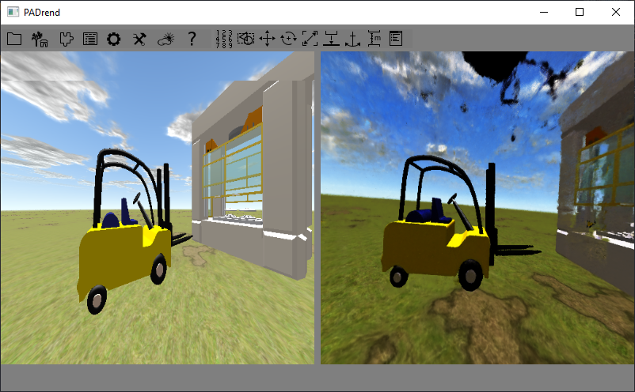

# RenderFlow

// TODO tensorflow gpu support

This plugin defines the new EScript type <code>RenderFlow.Flow</code>.<br/>
A <code>Flow</code> defines how the render process should be modified.<br/>
Therefore a new <code>render()</code> method can be defined in EScript or in Python with access to the pixels by the standard renderer.<br>
In EScript, a tensorflow saved model can be used via an given interface.<br/>
If the <code>render()</code> method is defined in Python, arbitrary EScript code can be evaluated.

### Content:
- Installation
- RenderFlow.PythonModule
- RenderFlow.Flow
- EScript functions
- Python functions
- Examples
  - Tensorflow models
  - Prerendering
  - Tensorflow + prerendering

### Installation:

1. Install Python3 (< 3.11, because tensorflow support is missing there)
2. Follow [this tutorial](https://www.tensorflow.org/install/pip#windows-native) for installing tensorflow 2.10 on Windows native, but <b>without</b> conda
3. Clone RenderFlow to <code>extPlugins/</code>
4. Configure and build in <b>release</b> mode
5. Activate in PADrend: <i>Config > Plugins > RenderFlow</i>
6. Restart PADrend
7. Enjoy!😊
<!-- ('export PYTHONFAULTHANDLER=1' for more detailed error messages) -->

### `RenderFlow.PythonModule`:
```ts
// load the module at path
// reuse: if already loaded before, use that same instance
new PythonModule(String path, Bool reuse = True)

// execute the given function and pass the arguments
Object execute(String functionName, ...Object args)
```

#### Example:
```python
# Test.py
print("hello from Python!")

name = "Alice"

def test(a, b, c):
    global name
    print("hey " + str(a) + " from " + name + ", " + str(b * c))
    name = a
```
```ts
var test = new RenderFlow.PythonModule("Test.py");
// -> "hello from Python!"
test.execute("test", "Leo", 6, 7);
// -> hey Leo from Alice, 42.0

// reuse loaded module instance
var test2 = new RenderFlow.PythonModule("Test.py", true);
test2.execute("test", "Bob", 2, 3);
// -> hey Bob from Leo, 6.0

// new module instance
var test3 = new RenderFlow.PythonModule("Test.py", false);
// -> hello from Python!
test3.execute("test", "Eve", 4, 2);
// -> hey Eve from Alice, 8.0
```

### <code>RenderFlow.Flow</code>:
```ts
void onActivate() // called after initializing python and model
void onDeactivate() // called after finalizing python and model

// called every frame, prerender optionally given
// not called if PRERENDER_DIRECT or PYTHON_PATH is given
Number[] render(Number[] prerender = [])

NAME: String
DIM: [Number width, Number height] // dimensions
DATA_FROM_FLOAT: Bool = False // pixel values are integers in [0, 127] or floats in [0,1) 
FORMAT: "RGB" | "MONO" | "MONO_COLORMAP" = "RGB"
// RGB: three values per pixel
// MONO: one value per pixel
// MONO_COLORMAP: one value per pixel, but a colormap is used to transform it to RGB

PYTHON_PATH: String // path to python file

MODEL: String // path to saved model directory
MODEL_SHAPE: [Number d1, ..., Number dn] // input dimensions for model
MODEL_INPUT: String // optional: input operation's name
MODEL_OUTPUT: String // optional: output operation's name

PRERENDER: Bool // activate prerender?
PRERENDER_DIM: [Number width, Number height] // dimensions for prerendering
PRERENDER_DIRECT: Bool // True -> Prerendered pixels are directly forwarded to model without calling 'render()'
PRERENDER_DIRECT_CACHE: Bool // True -> don't call the model again for same input
PRERENDER_SPLITSCREEN: Bool // True -> display the original and the flow's render result
```



Registered flows can be activated in the menu.

### EScript functions:

```ts
void register(Flow flow) // register the flow, so that it's displayed in the RenderFlow menu
void activate(Flow flow) // activate the flow, deactivate the current flow
void deactivate() // deactivate the current flow

Flow getFlow() // get the current flow

Number[] predict(Number[] data, Bool cache = True) // cache -> don't call the model again for same input

Number[] uint8ToFloat(Number[] data) // x -> floor(x / 255)
Number[] floatToUint8(Number[] data) // x -> clamp(x, 0.0, 1.0) * 255

[Number angleH, Number angleV] getCameraAngles(Camera cam) // get the camera's angles
Number[] screenshot(Number width, Number height) // take a screenshot


getTextureData: internal
setTextureData: internal
directPrerender: internal

pythonInit: internal
finalizeModule: internal
pythonRenderTexture: internal
pythonPRenderTexture: internal

loadModel: internal
unloadModel: internal
```

### Python functions:

```python
import escript

# example
[a, b, c] = escript.eval("""
    var x = 42;
    var y = [2, 3, 4];
    var z = "Hallo";

    return [x, y, z];
""")

def init():
    # optional

def finalize():
    # optional, release used memory (especially tensorflow models)

def render(prerender):
    return [1, 2, 3, ...]

```

### Examples:

All of the following examples can be found in `/flows/`<br/>
They are added to the global scope, so you can use them with e.g.:  `RenderFlow.activate(RenderFlow.simpleFlow);`

```ts
var simpleFlow = new RenderFlow.Flow({
    RenderFlow.Flow.NAME: 'simpleFlow',
    RenderFlow.Flow.DIM: [100, 100],
    RenderFlow.Flow.FORMAT: 'RGB'
});

simpleFlow.onActivate @(override) := fn() {
    outln("simpleFlow activated");
};
simpleFlow.onDeactivate @(override) := fn() {
    outln("simpleFlow deactivated");
};

simpleFlow.render @(override) := fn(prerender) {
    var output = [];

    for(var i = 0; i < 100 * 100 * 3; i++) {
        output[i] = ((i / 3) + (i % 3) * 40) % 256;
    }
    
    return output;
};

RenderFlow.register(simpleFlow);
```
This flow will genrate the folowing output:<br>

But array handling in EScript is highly inefficient.<br>
Therefore you can use Python with `numpy`:
```ts
var pythonSimpleFlow = new RenderFlow.Flow({
    RenderFlow.Flow.NAME: 'pythonSimpleFlow',
    RenderFlow.Flow.PYTHON_PATH: __DIR__ + '/Simple.py',
    
    RenderFlow.Flow.DIM: [100, 100],
    RenderFlow.Flow.FORMAT: 'RGB'
});

RenderFlow.register(pythonSimpleFlow);
```

```python
# Simple.py
import numpy as np

def render():
    a = np.ones([100* 100* 3])
    for i in range(len(a)):
        a[i] = ((i / 3) + (i % 3) * 40) % 256
    
    return a
```
<br>
With numpy you can use some more advanced array techniques:

```python
def render():
    a = np.ones([100, 100, 3])
    a *= 42
    a[30:, :, 0] *= 3
    a[60:, :, 0] *= 2
    a[60:, :, 2] *= 4
    a[:, :50, 1] *= 0
    a[30:, :70, 1] += 30
```
This leads to the following output:<br>


### Tensorflow models:
The following flow renders (kind of) a map dependend on the camera position.<br>
You need to download and extract [model.zip](https://schoolyourself.de/downloads/model.zip) to `/flows/model/`.
```ts
var myFlow = new RenderFlow.Flow({
    RenderFlow.Flow.NAME: 'myFlow',

    RenderFlow.Flow.MODEL: __DIR__ + '/model',
    RenderFlow.Flow.MODEL_SHAPE: [2],

    RenderFlow.Flow.PRERENDER: false,
    
    RenderFlow.Flow.DATA_FROM_FLOAT: true,
    RenderFlow.Flow.DIM: [64, 64],
    RenderFlow.Flow.FORMAT: 'MONO_COLORMAP'
});

static cache = false;

myFlow.render @(override) := fn() {
    var cam = PADrend.getActiveCamera();

    var input = [cam.getWorldPosition().getX() / 10, cam.getWorldPosition().getZ() / 10];
    var output = RenderFlow.predict(input, cache);
    return output;
};

RenderFlow.register(myFlow);
```

<br>
The same can be achieved with Python:

```ts
var pythonMyFlow = new RenderFlow.Flow({
    RenderFlow.Flow.NAME: 'pythonMyFlow',
    RenderFlow.Flow.PYTHON_PATH: __DIR__+'/MyFlow.py',

    RenderFlow.Flow.PRERENDER: false,
    
    RenderFlow.Flow.DATA_FROM_FLOAT: true,
    RenderFlow.Flow.DIM: [64, 64],
    RenderFlow.Flow.FORMAT: 'MONO_COLORMAP'
});
RenderFlow.register(pythonMyFlow);
```
```python
# MyFlow.py
import numpy as np
import tensorflow as tf
from pathlib import Path
import escript

cache = False
model = None
lx, lz, lr = None, None, None

def init():
    print("Hello World, by Python!")
    global model
    model = tf.saved_model.load(str(Path(__file__).parent.absolute()) + '/model/')
    print("p: Model loaded!")


def finalize():
    print("Goodbye, by Python!")
    global model
    model = None


def render():
    x, z = escript.eval("""
        var cam = PADrend.getActiveCamera();
        return [cam.getWorldPosition().getX(), cam.getWorldPosition().getZ()];
    """)

    global lx, lz, lr
    if cache and x == lx and z == lz:
        return lr

    r = model(np.array([[x / 10, z / 10]], dtype="float32")).numpy()
    lx, lz, lr = x, z, r
    return r

```

### Prerendering
```ts
var pythonPrerenderFlow = new RenderFlow.Flow({
    RenderFlow.Flow.NAME: 'python',
    RenderFlow.Flow.PYTHON_PATH: __DIR__+'/Prerender.py',

    RenderFlow.Flow.PRERENDER: true,
    RenderFlow.Flow.PRERENDER_DIM: [648, 648],
    RenderFlow.Flow.PRERENDER_SPLITSCREEN: true,
    
    RenderFlow.Flow.DIM: [648, 648],
    RenderFlow.Flow.FORMAT: 'RGB'
});

RenderFlow.register(pythonPrerenderFlow);
```
```python
# Prerender.py
import numpy as np

def render(prerender):
    a = np.flip(prerender)
    return a
```
The same would work in EScript only, but array manipulation is much easier in Python.😉<br>

On the left, you see the original image, next to it the modified version.

### Prerendering + Tensorflow
The used model was trained by Florian Bürger and converted to a saved model with help from https://stackoverflow.com/a/67028058/6004362<br>

```ts
var upscaleFlow = new RenderFlow.Flow({
    RenderFlow.Flow.NAME: 'upscale',

    RenderFlow.Flow.MODEL: __DIR__ + '/upscaleModel/saved',
    RenderFlow.Flow.MODEL_SHAPE: [324, 324, 3],
    RenderFlow.Flow.MODEL_INPUT: 'serving_default',
    RenderFlow.Flow.MODEL_OUTPUT: 'out',

    RenderFlow.Flow.PRERENDER: true,
    RenderFlow.Flow.PRERENDER_DIM: [324, 324],
    RenderFlow.Flow.PRERENDER_DIRECT: true,
    RenderFlow.Flow.PRERENDER_DIRECT_CACHE: false,
    RenderFlow.Flow.PRERENDER_SPLITSCREEN: true,
    
    RenderFlow.Flow.DIM: [648, 648],
    RenderFlow.Flow.FORMAT: 'RGB'
});

RenderFlow.upscaleFlow := upscaleFlow;
```
Due to `PRERENDER_DIRECT`, we don't need a `render(prerender)` method, instead the prerendered pixels a sent directly to the model.<br>
As you can see, `MODEL_INPUT` and `MODEL_OUTPUT` are set, this depends on the saved model.<br>


The same can be done (with much more effort) in Python:

```ts
var pythonUpscaleFlow = new RenderFlow.Flow({
    RenderFlow.Flow.NAME: 'pythonUpscale',
    RenderFlow.Flow.PYTHON_PATH: __DIR__ + '/Upscaling.py',

    RenderFlow.Flow.PRERENDER: true,
    RenderFlow.Flow.PRERENDER_DIM: [324, 324],
    RenderFlow.Flow.PRERENDER_DIRECT_CACHE: false,
    RenderFlow.Flow.PRERENDER_DIRECT: true,
    RenderFlow.Flow.PRERENDER_SPLITSCREEN: true,
    
    RenderFlow.Flow.DIM: [648, 648],
    RenderFlow.Flow.FORMAT: 'RGB'
});

RenderFlow.register(pythonUpscaleFlow);
```
```python
# Upscaling.py
import numpy as np
import tensorflow as tf
from pathlib import Path

def init():
    global model
    model = tf.saved_model.load(str(Path(__file__).parent.absolute()) + '/upscaleModel/saved/')

def finalize():
    global model
    model = None

def render(prerender):
    a = prerender.reshape(1, 324, 324, 3).astype("float32") / 256

    tn = tf.convert_to_tensor(a)
    r = model.signatures["serving_default"](tn)["out"]
    r = np.clip(r.numpy()*256, 0, 255)

    return r
```

### TinyNerf
You can train and render [TinyNerf](https://colab.research.google.com/github/bmild/nerf/blob/master/tiny_nerf.ipynb) models:



At first, activate the <i>TinyNerf</i>-flow in the menu.

```js
var module = new RenderFlow.PythonModule("../extPlugins/RenderFlow/flows/TinyNerf.py");

// start (or continue) training for 'iters' iterations
module.execute("startTraining", iters: Number);

// generate 'count' screenshots from random poses and store as .npz as 'filename'
module.execute("sample", count: Number, filename: String);

// save model to directory 'path'
module.execute("saveModel", path: String);

// load model from directory 'path'
module.execute("loadModel", path: String, width: Number, height: Number, focal: Number);

// rotation speed for rendering, set -1 for wasd-controll
module.execute("setSpeed", speed: Number);

// set the angles (for speed=0)
module.execute("setAngles", theta: Number, phi: Number, radius: Number);

// reset model
module.execute("resetModel");


//module.execute("loadModel", "tinyPADrendModel", 100, 100, 130);
//module.execute("loadModel", "tinyDrumsModel", 100, 100, 200);
//module.execute("loadModel", "tinyExcavatorModel", 100, 100, 200);
```


### Instant NGP
You can train and render [Instant NGP](https://github.com/NVlabs/instant-ngp) models:



Therefore, you have to [build it](https://github.com/NVlabs/instant-ngp#building-instant-ngp-windows--linux) in the directory "*RenderFlow/flows/instant-ngp/*" as the flow is using the Python bindings.

At first, activate the <i>instant-ngp</i>-flow in the menu.
After (generating and) loading transforms, you can start the training and move freely in the scene.

```js
var module = new RenderFlow.PythonModule("../extPlugins/RenderFlow/flows/InstantNGP.py");

// generate 'frames' screenshots from random poses and store together with a transforms.json in directory
module.execute("createTransforms", frames: Number, directory: String = "instant-ngp/data/nerf/temp");
// generate screenshots from given poses and store together with a transforms.json in directory
// attention: poses transformation to PADrend is not 100% correct
module.execute("createTransforms", frames: Number[16][], directory: String = "instant-ngp/data/nerf/temp");

// load transforms.json with images
module.execute("loadTransforms", path: String = "instant-ngp/data/nerf/temp/transforms.json");

// start (or continue) training for 'iters' iterations
module.execute("startTraining", iters: Number);


// save model at 'path'
module.execute("saveSnapshot", path: String="instant-ngp/data/nerf/temp/base.ingp");

// load model from 'path'
module.execute("loadSnapshot", path: String="instant-ngp/data/nerf/temp/base.ingp");


// module.execute("createTransforms", [
//     [0.880966, 0, -0.473181, -1.49992, 0, 1, 0, 1.62617, 0.473181, 0, 0.880966, 3.38497, 0, 0, 0, 1],
//     [0.880966, 0, -0.473181, -3.85358, 0, 1, 0, 1.62617, 0.473181, 0, 0.880966, 7.76699, 0, 0, 0, 1],
//     [0.880966, 0, -0.473181, -6.49552, 0, 1, 0, 1.62617, 0.473181, 0, 0.880966, 12.6857, 0, 0, 0, 1],
//     [0.880966, 0, -0.473181, -7.0787, 0, 1, 0, 1.62617, 0.473181, 0, 0.880966, 4.34496, 0, 0, 0, 1],
//     [0.433863, 0, -0.900979, -7.58806, 0, 1, 0, 3.60678, 0.900979, 0, 0.433863, 0.612725, 0, 0, 0, 1],
//     [-0.173333, 0, -0.984864, -6.74611, 0, 1, 0, 2.81406, 0.984864, 0, -0.173333, -4.45465, 0, 0, 0, 1],
//     [-0.173333, 0, -0.984864, -3.27024, 0, 1, 0, 2.81406, 0.984864, 0, -0.173333, -7.00095, 0, 0, 0, 1],
//     [-0.980249, 0, -0.197771, 2.11895, 0, 1, 0, 2.81406, 0.197771, 0, -0.980249, -8.99828, 0, 0, 0, 1],
//     [-0.980249, 0, -0.197771, 4.4375, 0, 1, 0, 2.81406, 0.197771, 0, -0.980249, -7.29558, 0, 0, 0, 1],
//     [-0.980249, 0, -0.197771, 6.55377, 0, 1, 0, 2.81406, 0.197771, 0, -0.980249, -5.45811, 0, 0, 0, 1],
//     [-0.786353, 0, 0.617779, 6.55377, 0, 1, 0, 2.81406, -0.617779, 0, -0.786353, -5.45811, 0, 0, 0, 1],
//     [-0.786353, 0, 0.617779, 11.4312, 0, 1, 0, 2.81406, -0.617779, 0, -0.786353, -6.7819, 0, 0, 0, 1],
//     [-0.786353, 0, 0.617779, 11.153, 0, 1, 0, 2.81406, -0.617779, 0, -0.786353, -3.42581, 0, 0, 0, 1],
//     [-0.28925, 0, 0.957255, 10.9425, 0, 1, 0, 2.81406, -0.957255, 0, -0.28925, -0.411291, 0, 0, 0, 1],
//     [0.28694, 0, 0.95795, 13.2167, 0, 1, 0, 2.81406, -0.95795, 0, 0.28694, 3.20483, 0, 0, 0, 1],
//     [0.487376, 0, 0.873194, 12.6239, 0, 1, 0, 2.81406, -0.873194, 0, 0.487376, 5.18377, 0, 0, 0, 1],
//     [0.487376, 0, 0.873194, 11.2517, 0, 1, 0, 2.81406, -0.873194, 0, 0.487376, 9.43814, 0, 0, 0, 1],
//     [0.487376, 0, 0.873194, 8.09793, 0, 1, 0, 2.81406, -0.873194, 0, 0.487376, 10.4362, 0, 0, 0, 1],
//     [0.98069, 0, 0.195577, -2.38841, 0, 1, 0, 2.81406, -0.195577, 0, 0.98069, 14.1021, 0, 0, 0, 1],
//     [0.965239, 0, -0.261374, -6.70042, 0, 1, 0, 2.81406, 0.261374, 0, 0.965239, 9.21657, 0, 0, 0, 1],
//     [0.965239, 0, -0.261374, -8.98566, 0, 1, 0, 2.81406, 0.261374, 0, 0.965239, 5.23726, 0, 0, 0, 1],
//     [0.965239, 0, -0.261374, -11.5241, 0, 1, 0, 2.81406, 0.261374, 0, 0.965239, -0.451557, 0, 0, 0, 1],
//     [0.208751, 0, -0.977971, -13.6198, 0, 1, 0, 2.81406, 0.977971, 0, 0.208751, -3.80222, 0, 0, 0, 1]
// ]);

//module.execute("loadTransforms", "instant-ngp/data/nerf/fox/transforms.json");
//module.execute("startTraining", 100);
```